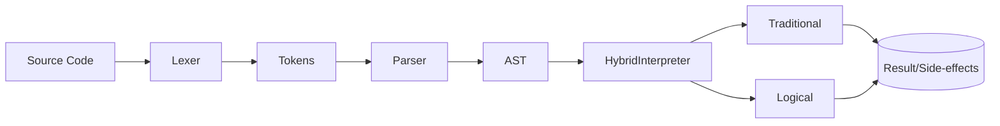
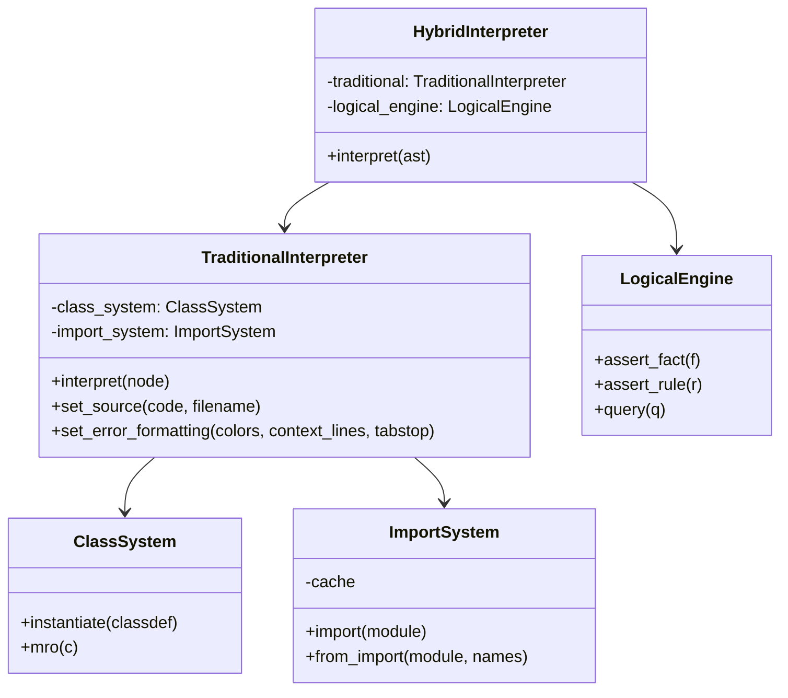
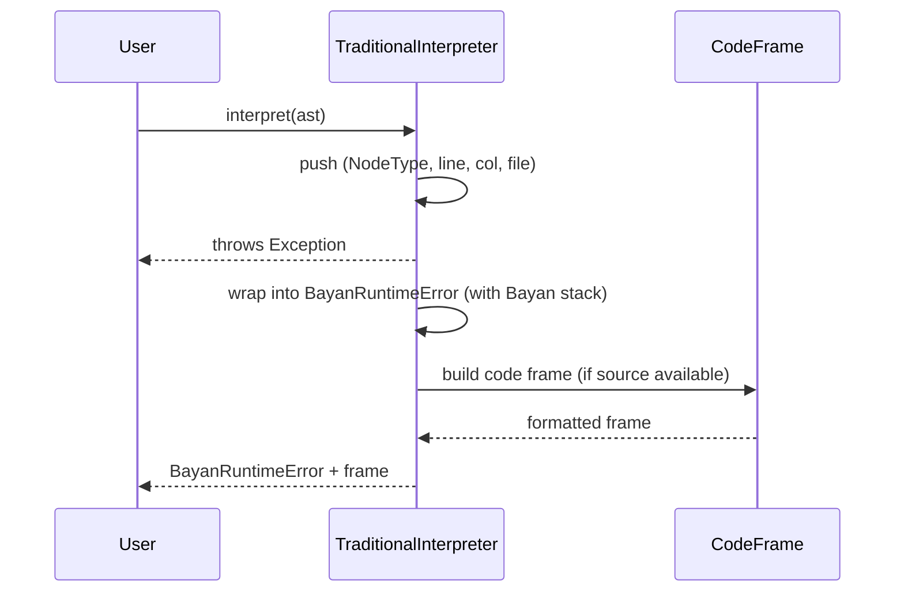

# Bayan Architecture — التصميم والمعمارية

هذه وثيقة تصميم عالية المستوى تبين تدفّق التنفيذ والمكوّنات الأساسية، مع رسومات Mermaid لتوضيح العلاقات.

## نظرة عامة
- طبقة Lexing: تحويل النص إلى Tokens مع line/column.
- طبقة Parsing: بناء AST مع metadata (line, column, filename).
- طبقة Interpreting: تنفيذ تقليدي + تنفيذ منطقي + طبقة هجينة تجمعهما.
- نظام الاستيراد: تحميل وحدات بيان ثم محاولة بايثون، مع تخزين مؤقت.
- طبقة الأخطاء: Bayan stack + code frame (ألوان اختيارية، عرض-واعي للمحارف).

## مخطط تدفّق التنفيذ

## طبقة المفسّر الهجين
- HybridInterpreter ينسّق بين المفسّر التقليدي والمنطقي.
- traditional_interpreter:
  - بيئات (global_env/local_env) ودوال وأصناف ونظام استيراد.
  - تتبّع call stack وإطارات أخطاء ملوّنة اختيارياً.
- logical_engine:
  - Term/Predicate/Fact/Rule + تنفيذ قواعد واستعلامات.

## علاقات فئات أساسية

## تسلسل خطأ وتشخيص

## نقاط تصميم أساسية
- إرفاق (line, column, filename) بعُقد AST مبكراً من parser.
- بناء code frame حساس لعرض المحارف/tabstop مع تلوين ANSI اختيارياً.
- super() بدعم صيغتين مع تتبّع owner stack لسلامة MRO.
- بروتوكولات dunder لتكامل العوامل/الحاويات/التكرار/الاستدعاء.

## أفكار مستقبلية
- API تشغيل من سطر الأوامر (CLI) لملفات .bayan.
- Type checker اختياري.
- REPL تفاعلي مع إبراز نحوي.

انتهى.

